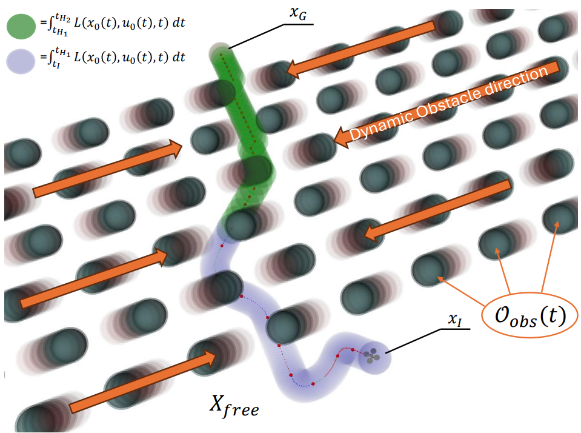
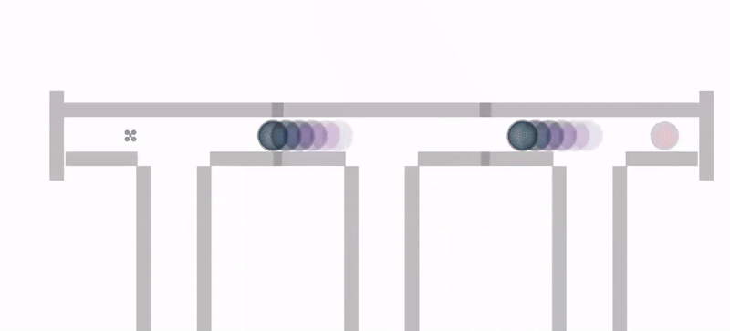

# Safe Lattice Planning for Motion Planning in Dynamic Environments



Image: Crosswalk3 scenario where DJI100 navigates through a crowd of dynamic obstacles. 

## Information
This project extends the Receding-Horizon Lattice Planner (RHLP) [[1]](https://ieeexplore.ieee.org/document/8618964)[[2]](https://ieeexplore.ieee.org/document/9385931) with new improvements to handle the edge cases in the dynamic environment. 

This new planner, Safe Lattice Planner (SLP) is evaluated in the provided benchmark against the baselines RRT*, Temporal RRT* and RHLP. This repository contains the benchmark, the baselines and SLP. This has been built in a Docker environment.

For more information, please see our [paper](liu.se).

## (Recommended) System Requirements
- Docker version 27.5.1, build 9f9e405
- OS: Ubuntu 22.04.5 LTS
- Kernel: 6.8.0-52-generic
- Driver Version: 535.183.01   CUDA Version: 12.2 (Dual NVIDIA GeForce RTX 2080 Ti)
- nvidia-container-toolkit: 1.14.3-1
- Python 3.10.12

## Installation and execution

### Installation
Follow the following steps to be able to run the planners.

1. Install and setup your [docker solution](https://docs.docker.com/engine/security/rootless/). If you are in AI-academy, use [this](https://gitlab.liu.se/ai-academy/ros-base) tutorial.
2. If you haven't already, clone the repository `git@github.com:emilcw/safelatticeplanning.git` and go to that folder in your terminal environment.
3. Inside every planner's folder, it is required to clone a [gazebo models folder](https://github.com/osrf/gazebo_models). This is to get the proper models for each world. Like this:
  * safelatticeplanning/rrt_star/gazebo_models
  * safelatticeplanning/time_based_rrt/gazebo_models
  * safelatticeplanning/lattice_planner/gazebo_models
  * safelatticeplanning/lattice_planner_improved/gazebo_models
4. The script "dev_env.sh" is used to manage docker. It is used in the following way: `./dev_env.sh COMMAND IMAGE EXTRA`

- To build an image, run: `./dev_env.sh build IMAGE`
  * Available images (one for each planner currently)
    - rrt_star
    - time_based_rrt
    - lattice_planner
    - lattice_planner_improved
  * So for example run `./dev_env.sh build lattice_planner_improved` to build the lattice_planner_improved container.

- Before running the code, we need to compile it with `./dev_env.sh make IMAGE`.
  - So for example run `./dev_env.sh make lattice_planner_improved` to build the `catkin_ws`.   

- To start a docker environment, run `./dev_env.sh start IMAGE`
  - So for example run `./dev_env.sh start lattice_planner_improved` to start the lattice_planner_improved container
- To open another terminal inside the same docker, run `./dev_env.sh bash IMAGE`
  - So for example run `./dev_env.sh lattice_planner_improved daep` to open another terminal inside the lattice_planner_improved container.

Other available commands:
 - `./dev_env.sh kill IMAGE`  - kill container

### Using the benchmark
To run the benchmark, utilize the provided simulation loop.
1. Configure `sdmp_parameters.yaml` as desired, see the file for explanations.
2. Compile the code for the planners you want to test using make (see above).
2. Run the python script to start the simulation and the data collection: `python3 sdmp.py`

This should start the simualtion environment, the selected motion planner and the scenario. The scenario will be run until the simulation time reaches its maximum or until the DJI100 reaches its goal. Data is collected continuously. Data wil be saved in `/experiment_data_sdmp`.

### Visualize data
To visualize the data, use the provided visulization script.
1. Copy `/experiment_data_sdmp` into `/visualization`
2. Configure `/visualize/visualize_sdmp.py`, namely edit:
    * simulation_runs
    * SIMULATION_TIME
    * EXPERIMENT_DATA_PATH
    * modes
    * scenarios
    * planners
3. Run the visualization script either by:
    * `python3 create_results.py`
    * Go into container (`./dev_env start visualization`) and `python3 visualize_sdmp.py`

## Showcase


*SLP in Warehouse3*



*SLP in Corridor2*


*SLP in Crosswalk3*


## Credits
If you find this work useful, please cite our paper.

*Safe Lattice Planning for Motion Planning with Dynamic Obstacles*
```
[INSERT CITATION]
```

This work has been developed by Emil Wiman and Mattias Tiger with the help and support of the members at the [Division of Artificial Intelligence and Integrated Computer Systems](https://liu.se/en/organisation/liu/ida/aiics) at [Linköping University](https://liu.se/en).

-----------------------------------------------------------------------------------------------

This work builds upon the work from two previous papers, they are listed here for completeness.

*Enhancing Lattice-Based Motion Planning With Introspective Learning and Reasoning*
```
@ARTICLE{9385931,
  author={Tiger, Mattias and Bergström, David and Norrstig, Andreas and Heintz, Fredrik},
  journal={IEEE Robotics and Automation Letters}, 
  title={Enhancing Lattice-Based Motion Planning With Introspective Learning and Reasoning}, 
  year={2021},
  volume={6},
  number={3},
  pages={4385-4392},
  keywords={Planning;Safety;Collision avoidance;Trajectory;Dynamics;Uncertainty;Lattices;Motion and path planning;collision avoidance},
  doi={10.1109/LRA.2021.3068550}}
```

*Receding-Horizon Lattice-Based Motion Planning with Dynamic Obstacle Avoidance*
```
@INPROCEEDINGS{8618964,
  author={Andersson, Olov and Ljungqvist, Oskar and Tiger, Mattias and Axehill, Daniel and Heintz, Fredrik},
  booktitle={2018 IEEE Conference on Decision and Control (CDC)}, 
  title={Receding-Horizon Lattice-Based Motion Planning with Dynamic Obstacle Avoidance}, 
  year={2018},
  volume={},
  number={},
  pages={4467-4474},
  keywords={Planning;Vehicle dynamics;Dynamics;Lattices;Trajectory;Navigation;Real-time systems},
  doi={10.1109/CDC.2018.8618964}}
```


## Contact
For questions and remarks please contact the developers by supplying an issue.

